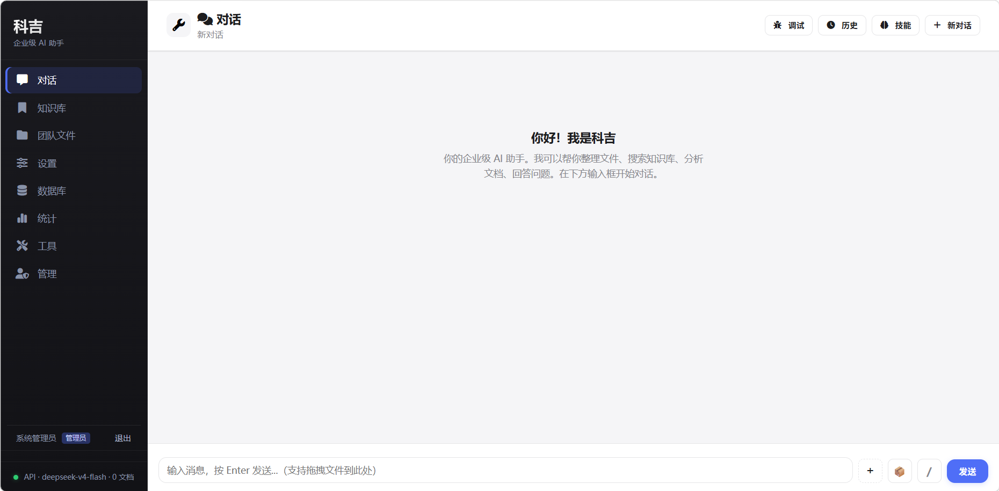

# 科吉 Agent (Keji)

Windows 上的**本地 / 局域网 AI 助手**：浏览器打开即可对话，支持多账号、团队共享文件夹、管理员后台。适合办公室内网一台服务器、多人通过网页访问。

**仓库地址：** https://github.com/Zuofeng198/keji

## 界面预览

启动后浏览器访问 `http://127.0.0.1:8000/` 的效果如下：



---

## 你能用它做什么

- 网页里和 AI 对话（流式回复，会话按用户保存）
- **团队文件**：共享目录 + 每人独立目录，网页上传/浏览
- **三种角色**：管理员 / 成员（可写自己+共享）/ 只读（仅读、不可用写入类工具）
- 可选：Word/Excel、知识库检索、数据分析、MCP 工具（需 Node.js）

---

## 5 分钟上手（Windows）

### 第 0 步：准备软件

| 软件 | 是否必须 | 说明 |
|------|----------|------|
| [Git](https://git-scm.com/) | 必须 | 克隆代码；**请安装 [Git LFS](https://git-lfs.github.com/)**（离线依赖包在 LFS 里） |
| [Python 3.12](https://www.python.org/downloads/) 64 位 | 必须 | 与仓库内离线 wheel 一致；安装时勾选 **Add to PATH** |
| [Node.js 18+](https://nodejs.org/) | 可选 | 完整 MCP 能力；不装也能先聊天 |

### 第 1 步：下载代码

```powershell
git clone https://github.com/Zuofeng198/keji.git
cd keji
git lfs install
git lfs pull
```

> `git lfs pull` 会下载约 **400MB** 离线依赖包，只需执行一次。若跳过 LFS，部署时会改为联网下载（较慢）。

### 第 2 步：一键安装环境

双击 **`setup_deploy.bat`**（或 `一键部署.bat`）。

脚本会自动：创建 `venv`、从本地 wheel 安装依赖、生成 `config.yaml` / `.env`、创建数据目录。

### 第 3 步：填写密钥

用记事本打开项目根目录 **`.env`**，至少改这两项：

```env
DEEPSEEK_API_KEY=sk-你的DeepSeek密钥
KEJI_ADMIN_PASSWORD=你想设置的管理员密码
```

保存后关闭。其他项可暂时留空；启动时若提示某环境变量未设置，多为可选项，补全 `.env` 后重启即可。

模型默认 DeepSeek，在 `config.yaml` 的 `models` 段可改。

### 第 4 步：启动

| 方式 | 操作 |
|------|------|
| **推荐** | 双击 **`launch_keji.bat`** → 自动打开浏览器 |
| 看日志 | 双击 **`run_server.bat`** → 黑窗里运行，停服务按 `Ctrl+C` |

- 本机访问：http://127.0.0.1:8000/
- 局域网访问：http://**服务器IP**:8000/（同一 WiFi/内网的其他电脑）

### 第 5 步：登录

1. 浏览器打开上述地址  
2. 使用管理员账号登录（默认用户名见 `config.yaml` 里 `security.bootstrap_admin.username`，一般为 `admin`）  
3. 密码为你在 **`.env`** 里设置的 `KEJI_ADMIN_PASSWORD`  

首次登录后可在管理页面创建其他用户（成员 / 只读）。

---

## 常用脚本说明

| 文件 | 用途 |
|------|------|
| `setup_deploy.bat` / `一键部署.bat` | 新机安装 Python 虚拟环境与依赖 |
| `launch_keji.bat` / `启动科吉.bat` | 后台启动服务并打开网页 |
| `run_server.bat` / `运行服务.bat` | 带黑窗启动（排错时用） |
| `package_wheels.bat` | 在本机重新打包离线 wheel（换 Python 版本时用） |

---

## 配置说明

| 文件 | 作用 | 是否上传 Git |
|------|------|----------------|
| `.env` | API Key、管理员密码、JWT 密钥 | 否（本地私密） |
| `config.yaml` | 模型、MCP、安全策略 | 否（从 `config.example.yaml` 复制） |
| `config.example.yaml` | 配置模板 | 是 |
| `.env.example` | 环境变量模板 | 是 |

**不要**把填好密钥的 `.env` / `config.yaml` 提交到公开仓库。

---

## 角色与权限（简要）

| 角色 | 对话 | 文件 |
|------|------|------|
| **admin** | 全部工具 | 整个工作区 |
| **member** | 可写工具 | 共享目录 + 自己的 `users/<id>/` |
| **readonly** | 仅读/查询类工具 | 仅读共享 + 自己的目录 |

团队文件物理路径：`data/workspace/shared/`、`data/workspace/users/<用户ID>/`。

---

## 停止服务

- 用 `run_server.bat` 启动的：在黑窗按 **Ctrl+C**
- 用 `launch_keji.bat` 启动的：任务管理器结束 **pythonw.exe**，或 PowerShell：

```powershell
Get-NetTCPConnection -LocalPort 8000 -ErrorAction SilentlyContinue |
  ForEach-Object { Stop-Process -Id $_.OwningProcess -Force }
```

---

## 常见问题

**Q：克隆后没有 `offline_packages` 或部署仍要联网？**  
A：执行 `git lfs install` 后 `git lfs pull`。

**Q：必须用 Python 3.12 吗？**  
A：本仓库自带的离线 wheel 是 **3.12**。若你只有 3.10/3.11，可删掉 `offline_packages` 后运行 `setup_deploy.bat` 走联网安装。

**Q：启动后一堆「环境变量未设置」警告？**  
A：在 `.env` 补 `DEEPSEEK_API_KEY` 等；飞书、OpenAI 不用可忽略。

**Q：双击 `main.py` 闪退？**  
A：不要双击 py 文件，请用 `launch_keji.bat` 或 `run_server.bat`。

**Q：pip 安装失败？**  
A：确认 Python 为 64 位；或在有网环境重新运行 `setup_deploy.bat`。

**Q：局域网别人访问不了？**  
A：检查 Windows 防火墙是否放行 **8000** 端口；用服务器内网 IP，不要用 `localhost`。

---

## 更多文档

- [新机部署详细步骤](docs/新机部署.md)
- [离线 / 内网部署](docs/离线部署.md)
- [使用指南（功能与页面）](docs/使用指南.md)
- [项目目录说明](docs/项目目录说明.md)

---

## 技术栈

FastAPI · nanobot · SQLite 用户/会话 · JWT 鉴权 · 可选 MCP / Chroma 知识库

## 许可

本项目采用 [MIT License](LICENSE)。

使用各 AI 模型 API（如 DeepSeek）及第三方依赖时，请遵守其各自的服务条款与许可。
